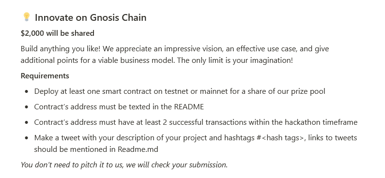
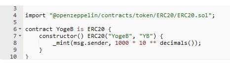
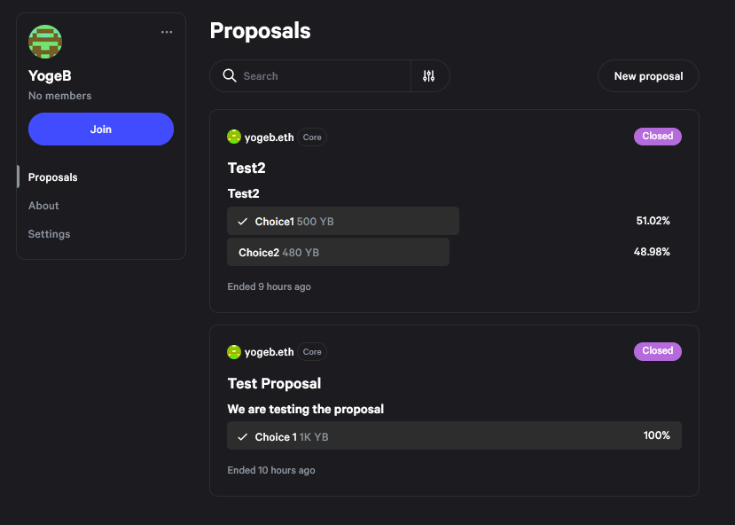

# GnosisSnapshot
Experiment with token governance on Gnosis Chain using snapshot

## [ERC20 Contract Deployed](https://gnosisscan.io/token/0xb59e7c11742f111a2f3690b63eebc6f5a493422c) <<< Click Here

## [Tweet Chain](https://twitter.com/OmniAnalytics/status/1713802214932639835) <<< Click Here

## [Snapshot Space](https://snapshot.org/#/yogeb.eth) <<< Click Here

## [Snapshot Proposal](https://snapshot.org/#/yogeb.eth/proposal/0x3afacc670e0d7dcf676371e16e7b884946d1d2eefa3cee074c924d716e3fb1c9) <<< Click Here

### Intro

For the "Innovate on Gnosis Chain" we were given the leeway to just try anything out, well being a bunch of DAO enthusiasts, we used this as an excuse to experiment token governance on the Gnosis chain!

Proposal

 

We followed some simple best practices by going over to OpenZeppelin and finding a basic token contract that we could modify and deploy. Introducing the "YogeB" token. 😅

ERC20 Contract

 

We then opened up a space on Snapshot to test how we'd enable governance for our new test token.

Snapshot Space

 

After everything was setup, we airdropped our "YogeB" token onto a few frens, setup the Snapshot and now we're ready to DAO it up!

Snapshot Proposal

 
